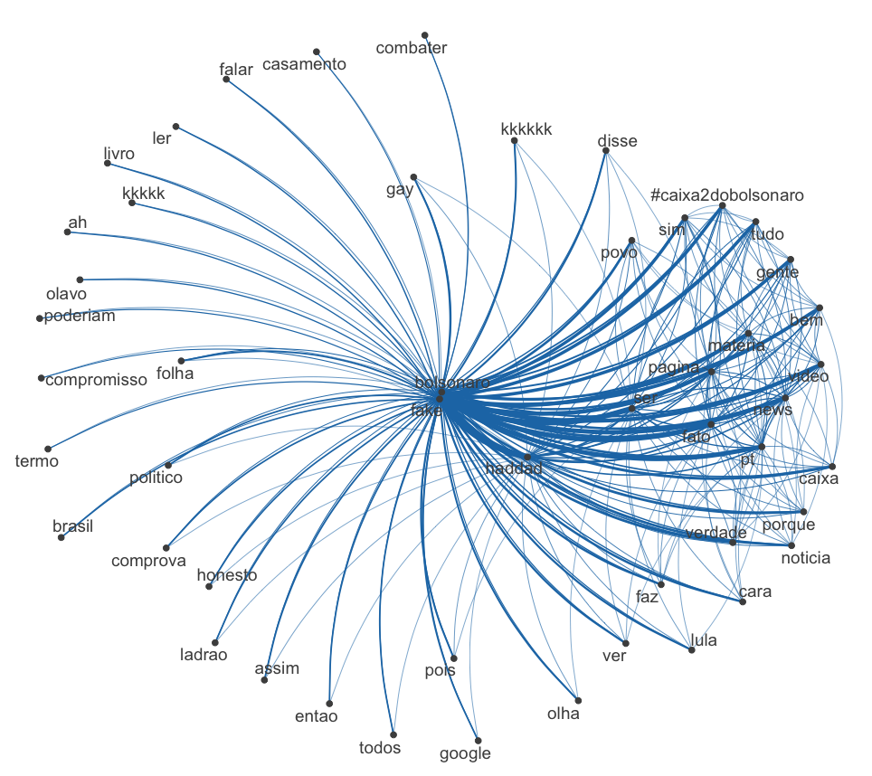
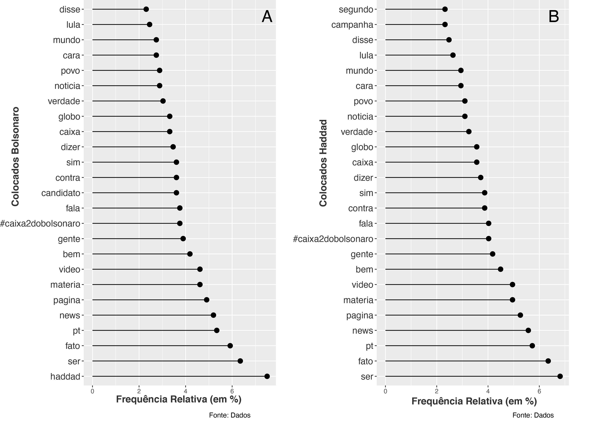
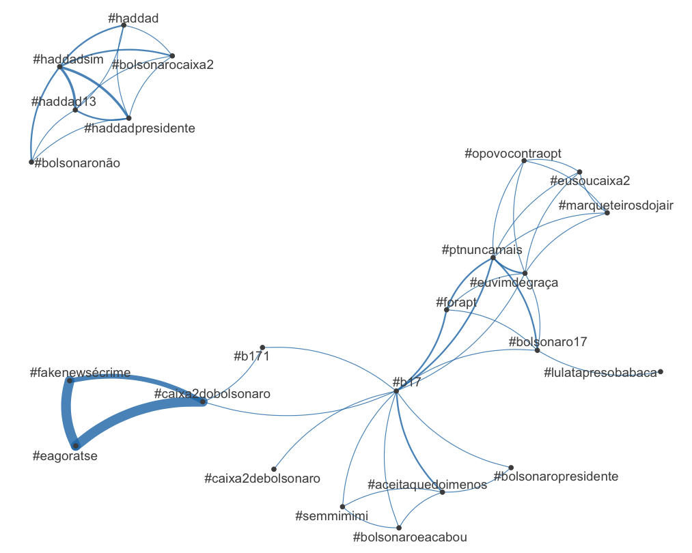

# Thank you note

We hope this script is useful for researchers in fields of linguistics and applied linguistics. Unfortunately due to regulations form the committee for research ethics, we cannot provide data in this repository. If you have any further questions, please feel free to drop us a line.

# General Information

This repository describes the methods used in our article: "AVALIATIVIDADE EM COMENTÁRIOS EM POSTAGENS DEDICADAS À VERIFICAÇÃO DE NOTÍCIAS FALSAS NAS ELEIÇÕES PRESIDENCIAIS DE 2018". 

The article is still in peer evaluation, soon as we have it published, we will post it here. 

This guide describes the many procedures we had during the research:

1. Data collection
1. R scripts for data analysis 
	- R scripts for visualisation
	- R scripts for concordancing
	

# Data collection
The data in this article were collect from some posts by [Fato ou Fake](https://g1.globo.com/fato-ou-fake/) in [Facebook](https://pt-br.facebook.com/fatooufake/), a information checking agency in Brazil. Please, see the article for specific dates. 

Unfortunately, the tool used for data collection, Netvizz, is no longer working because of Facebook's new policies. Today an alternative would be [Facepage](https://github.com/strohne/Facepager). 


All data was analysed using [R](https://www.r-project.org/), the following packages were part of our methodology:

## Loading packages

Each of this packages has a function in data analysis:

1. [Quanteda](https://quanteda.io/): Package for text-data processing and concordancing
2. [Ggplot2](https://ggplot2.tidyverse.org/): Package for data visualisation
3. [Dplyr](https://dplyr.tidyverse.org/): Package for data manipulation
4. [Forcats](https://forcats.tidyverse.org/): Package for handling categorical variables
5. [Readr](https://github.com/tidyverse/readr): Package for reading CSV (an other kinds) of rectangular data
6. [gridExtra](https://cran.r-project.org/web/packages/gridExtra/index.html): A package to print graphics side by side 

```{r, eval=FALSE, echo=TRUE}
library(quanteda)
library(readr)
library(ggplot2)
library(dplyr)
library(forcats)
library(gridExtra)
```

## Loading files

After the packages were loaded, it is time to load the comments in R. Netvizz used to generate **tab** delimited files. This command will open a window and let you choose the file. 

```{r,eval=FALSE, echo=TRUE}
corpus.FF.df <- read_delim(file.choose(), "\t", escape_double = FALSE, trim_ws = TRUE)
```

## Creating the corpus

The corpus was created using the following command

```{r, eval=FALSE, echo=TRUE}
#Please, note that the "field=text" indicates which field of the database was teh text source
comentarios.ff <-corpus(corpus.FF.df,text_field = "Text")
```

## Analysing the data

The next step was to create a network representation of the texts. The following sequence of commands help us to do so. We created a sparse feature co-occurrence matrix, which will also help us to analyse collocates later. Note that we loaded a list of customised stopwords. This list contains some words which we needed to ignore but they were not in the original software list. They were mostly porper names and locations which woul identify aome Facebook users. 

```{r,eval=FALSE, echo=TRUE}
#The fist step was to create a a sparse feature co-occurrence matrix
corpus.FF.fcm <- fcm(comentarios.ff,
                   remove_numbers = TRUE, 
                   remove_punct = TRUE,
                   remove_symbols = TRUE,
                   remove_url = TRUE,
                   what = "word",
                   verbose  = T) %>% 
  dfm_remove(c(stopwords("portuguese"), My.stopwords)
```

Now we can create the network of words we have in the paper. 

```{r,eval=FALSE, echo=TRUE}
set.seed(100)
topfeat <- names(topfeatures(corpus.FF.fcm, 50))
fcm_select(corpus.FF.fcm, pattern = topfeat) %>%
    textplot_network(min_freq = 0.5)
```

The image would seem something like this:



Next step was to get the collocates from Bolsonado and Haddad. We worked with single frequences.Fist we start by Fernando Haddad. Some collumns were deleted because they had bas characters

```{r,eval=FALSE, echo=TRUE}
haddad <- convert(corpus.FF.fcm, to = "data.frame")
which(colnames(haddad)=="haddad" )
names(haddad)[names(haddad) == 'document'] <- 'word'
haddad.collocates <-haddad[30,]  
haddad.collocates <-  t(haddad.collocates)
haddad.collocates <- haddad.collocates[-1, ]
write.csv(haddad.collocates,"ff_02.csv")
read_delim('ff_02.csv', ",", escape_double = FALSE, trim_ws = TRUE)
haddad.collocates <- ff_02
colnames(haddad.collocates)<-c('Collocate','Freq')
haddad.collocates <- haddad.collocates[order(-haddad.collocates$Freq),]
haddad.collocates <- haddad.collocates[-c(1,10,28,36,25,26,20,34,38,42,44,50,52,56,60,53,68), ]
hc.g <- haddad.collocates[c(1:25), ]
```

Then for Jair Bolsonaro

```{r,eval=FALSE, echo=TRUE}
bolsonaro <- convert(corpus.FF.fcm, to = "data.frame")
names(bolsonaro)[names(bolsonaro) == 'document'] <- 'word'
bolsonaro.collocates <-bolsonaro[18,]  
bolsonaro.collocates <-  t(bolsonaro.collocates)
bolsonaro.collocates <- bolsonaro.collocates[-1, ]
write.csv(bolsonaro.collocates,"ff_01.csv")
bolsonaro.collocates <- ff_01
bolsonaro.collocates <- bolsonaro.collocates[order(-bolsonaro.collocates$Freq),]
bolsonaro.collocates <- bolsonaro.collocates[-c(22,3,28,27,36,38,11,30), ]
bh <- bolsonaro.collocates[c(1:25), ]
```

Now we plot them side by side:

```{r,eval=FALSE, echo=TRUE}
t01<- bh%>% 
  mutate(Collocate = fct_reorder(Collocate, -Proportion)) %>%
  ggplot(., aes(x=Collocate, y=Proportion))+
  geom_point(size=3) + 
  geom_segment(aes(x=Collocate, 
                   xend=Collocate, 
                   y=0, 
                   yend=Proportion)) +
  labs(caption="Fonte: Dados",
       x = "Colocados Bolsonaro",
       y = "Frequência Relativa (em %)") + 
  theme(axis.text.y = element_text(color = "grey20", size = 13),
        axis.title.x = element_text(color = "grey20", size = 12),
        axis.title.y = element_text(color = "grey20", size = 12))+
  coord_flip()

t02 <- hc.g%>% 
  mutate(Collocate = fct_reorder(Collocate, -Proportion)) %>%
  ggplot(., aes(x=Collocate, y=Proportion))+
  geom_point(size=3) + 
  geom_segment(aes(x=Collocate, 
                   xend=Collocate, 
                   y=0, 
                   yend=Proportion)) +
  labs(caption="Fonte: Dados",
       x = "Colocados Haddad",
       y = "Frequência Relativa (em %)") + 
  theme(axis.text.y = element_text(color = "grey20", size = 13),
        axis.title.x = element_text(color = "grey20", size = 12),
        axis.title.y = element_text(color = "grey20", size = 12))+
  coord_flip()
grid.arrange(t01, t02, ncol = 2)
```

The result should be something like this:



Our netx step was to analyse the hashtags. First we select the hashtag from the data. here we use a document-feature matrix. We analysed only the 30 more frequent. 

```{r,eval=FALSE, echo=TRUE}
comentarios.dfm <- dfm(comentarios,tolower = TRUE, verbose = TRUE)
tag_dfm <- dfm_select(comentarios.dfm, pattern = ("#*"), verbose = TRUE)
toptag <- names(topfeatures(tag_dfm, 30))
tag_fcm <- fcm(tag_dfm)
topgat_fcm <- fcm_select(tag_fcm, pattern = toptag)
```

Then we plot. 
```{r,eval=FALSE, echo=TRUE}
textplot_network(topgat_fcm, vertex_labelsize = 1.5 * rowSums(topgat_fcm)/min(rowSums(topgat_fcm)))
```

The result should be something like this:



For conordancing and extract examples, we used the following command, where **WORD** is our search query

```{r,eval=FALSE, echo=TRUE}
View(kwic(comentarios, pattern="WORD", window=20, valuetype = "regex"))
```


